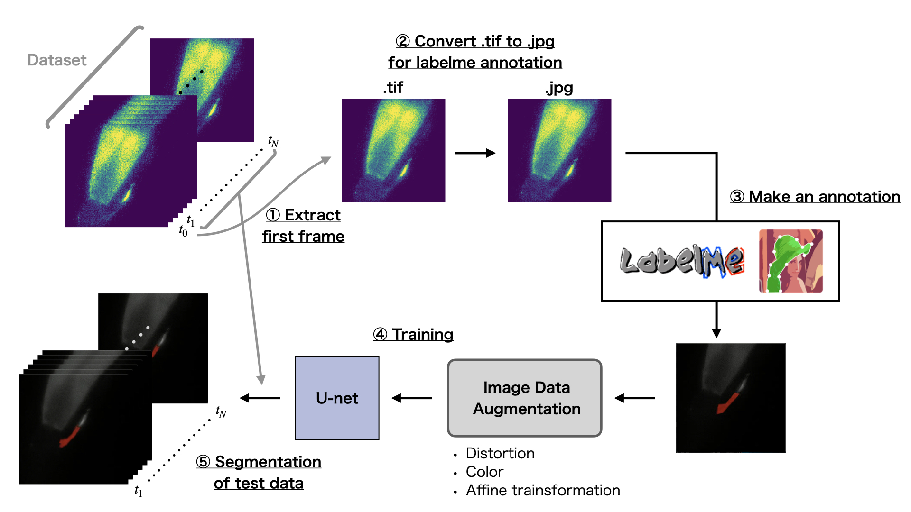
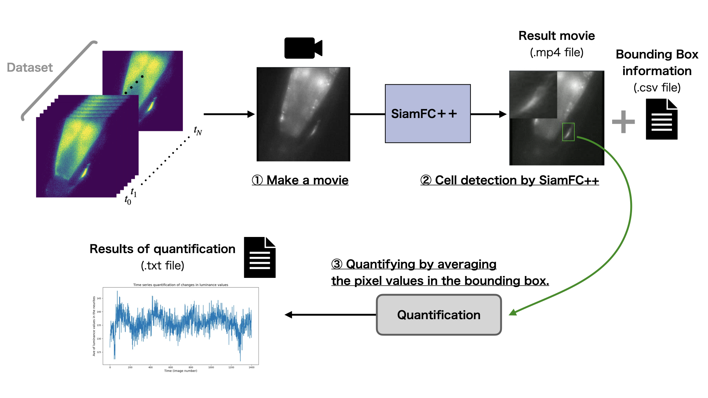

# Unet_SingleImage_Segmentation

## Image Segmentation with the first frame of dataset.

Project for RA.

## How to Run 

### (1),(2) Converting the initial frame .tif to .jpg

To create an annotation using Labelme, convert it to a .jpg image, since .tif images are not displayed in Labelme. 

```bash
python make_first_frame_jpg.py --PATH [Path to dataset folder storing .tif images]
```
Example
```
python make_first_frame_jpg.py --PATH /data/Users/katafuchi/RA/Nematode/2021_0323_dia10-5-gcy28d-GCaMP6f+paQuasAr3-11
```
or 
```bash
sh make_first_frame_jpg.sh
```

### (3) Creating initial frame annotations with Labelme

Installation [labelme](https://github.com/wkentaro/labelme)
```bash
pip install labelme
```

Activation
```bash
labelme
```

### (4),(5) Training & Segmentation of test data

```bash
python main.py --DATA_PATH [Path to dataset folder storing .tif images] --MASK_NAME [.json mask files] --SAVE_PATH [Saving folder]
```

Example
```bash
python main.py \
  --DATA_PATH /data/Users/katafuchi/RA/Nematode/2021_0303_dia10-5-gcy28d-GCaMP6f+paQuasAr3-3 \
  --MASK_NAME /data/Users/katafuchi/RA/Nematode/labelme_mask/2021_0323_dia10-5-gcy28d-GCaMP6f+paQuasAr3-3_0000.json \
  --SAVE_PATH /Results/2021_0303_dia10-5-gcy28d-GCaMP6f+paQuasAr3-3
```
or 
```bash
sh main.sh
```


### Training with multiple first frame datasets & Segmentation of test data

#### Training
```bash
python main_multiple.py \
    --DATA_PATH_LIST [Training data folders storing .tif images] \
    --MASK_NAME [.json mask files] \
    --SAVE_PATH [Saving folder] \
    --train [If train, set --train] \
    --kind [GC or pa] \
    --preprocess [If apply image preprocessing, set --preprocess] \
    --aug_times [the number of times] \
    --epochs [the number of epochs]
```
See `main_multiple.sh` for details.

#### Test
```bash
python main_multiple.py \
    --DATA_PATH_LIST [Test data folders storing .tif images] \
    --SAVE_PATH [Parent saving directory. New saving folder with dataset name will be created in the saving folder.]  \
    --kind [GC or pa] \
    --preprocess [If apply image preprocessing, set --preprocess] \
    --model_path [Path of model created by training.] \
```
See `main_multiple.sh` for details.


---


## SiamFC++ cell detection and quantifying the pixel values of it.


### (1) Make a movie from an image sequence for SiamFC++ cell detection.
```bash
python img2movie.py \
	--data_path [Folder storing .tif images] \
	--save_path [Saving folder] \
	--kind [GC or pa classes]
```

Example

```bash
python img2movie.py \
	--data_path /data/Users/katafuchi/RA/Nematode/2021_0303_dia10-5-gcy28d-GCaMP6f+paQuasAr3-3 \
	--save_path /data/Users/katafuchi/RA/Nematode/movies \
	--kind pa
```
or 
```bash
sh img2movie.sh
```

### (2) SiamFC++ cell detection.

To use siamfc++, you need to set it up. See [README.md](siamfc++/README.md) in siamfc++.

```bash
cd video_analyst

python ./demo/main/video/sot_video.py --config ./experiments/siamfcpp/test/vot/siamfcpp_googlenet.yaml \
	--video [Path to a movie] \
	--output [Name of the video to be saved]
```
Example

```bash
python ./demo/main/video/sot_video.py --config ./experiments/siamfcpp/test/vot/siamfcpp_googlenet.yaml \
	--video /Users/macbookpro/Desktop/movies/2021_0323_dia10-5-gcy28d-GCaMP6f+paQuasAr3-18_pa.avi \
	--output /Users/macbookpro/Desktop/movie_siamfc++_result/2021_0323_dia10-5-gcy28d-GCaMP6f+paQuasAr3-18_pa.mp4
```

### (3) Quantifying the pixel values in the bounding box.

```bash
python cell_quantify.py \
	--DATA_PATH [Folder storing .tif images] \
	--CSV_PATH  [Csv file storing bbox values.] \
	--SAVE_PATH [Parent saving directory. New saving folder with dataset name will be created in the saving folder.] 
```
Example
```bash
python cell_quantify.py \
	--DATA_PATH /data/Users/katafuchi/RA/Nematode/2021_0303_dia10-5-gcy28d-GCaMP6f+paQuasAr3-3 \
	--CSV_PATH  /data/Users/katafuchi/RA/Nematode/cell_bbox/2021_0303_dia10-5-gcy28d-GCaMP6f+paQuasAr3-3_pa.csv \
	--SAVE_PATH /data/Users/katafuchi/RA/Nematode/results_cell_quantify 
```

